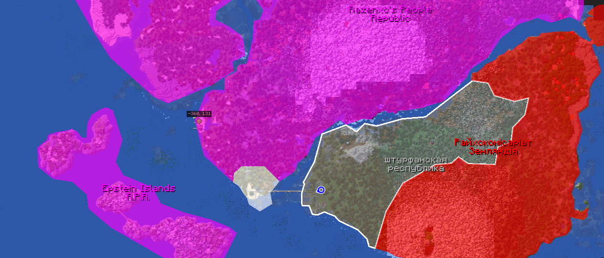

`Kriet` is a server where you can build, fight, and do whatever you want, with complete freedom and more. (`1.20.1` - `forge`)(`kriet.duckdns.org:25566`)

## History

The server was created on `4/28/2024` by two individuals, `gptdoktor` and `risknu`, with assistance from `тоффекс`, `Razenxc`, and others. The idea for the server originated from an incident involving administrator rights on the "Flopia" server, leading to the conception of an independent server where you can do anything you want!

### Season I
**Establishment of Main Nations**

Nations such as the Hotin People's Republic, Sturfan Republic, Raichсommonwealth Zealandia, British Empire, and Dunayiv People's Republic were founded.

The construction of initial mechanisms, first ships, deaths, building of houses, peaceful times.

Conflict between HPR and DPR began, an urgent operation was conducted to destroy SR, with a landing on the island and subsequent complete annihilation, after which the enemy struck back by hitting peaceful objects, burning houses, and damaging a couple of resource factories.
